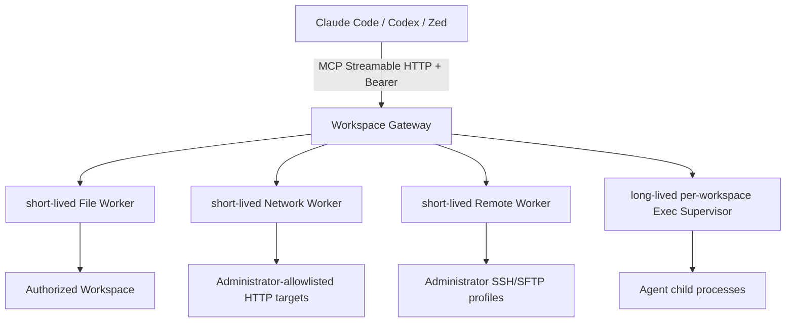
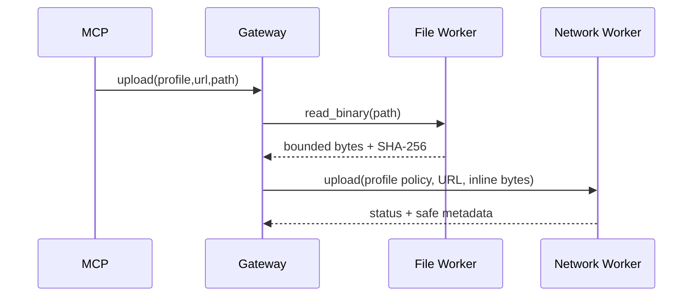

# Secure Remote Agent 架构

## 0. 定位与信任模型

本项目面向受控私网中的单用户开发机；Linux 是唯一 production Worker host。macOS/Windows 等构建仅用于开发与协议兼容，不能承载 production Worker。Claude Code、Codex、Zed 等客户端通过标准 MCP Streamable HTTP 直连 Gateway。项目不提供 GUI、任意 shell、任意 SSH 目标、任意内存地址/写内存、仓库自选凭据或公网多租户控制面。

安全边界由两层组成：

1. Bearer principal、MCP session、workspace、策略和审计在 Gateway 关联。
2. File、Network、Remote、Exec 分别使用独立随机 Ed25519 capability key；每个 workspace 也独立。File key、各 Worker key和 approval key 不复用。

可选能力默认不注册且策略默认拒绝。管理员必须显式配置 Worker/profile，并分别打开 `allow_network`、`allow_remote`、`allow_exec`、`allow_debug`、`allow_mem`；`download` 还受 `allow_write` 和 workspace `read_only` 限制。

## 1. 标准 MCP 主链路

单 workspace endpoint 是 `/mcp`；Registry 模式使用 `/mcp/<opaque-workspace-id>`，没有默认路由。`stdio-bridge` 只是 stdio-only 客户端的兼容层。

实现 MCP `2025-03-26` 的 initialize、`Mcp-Session-Id`、`MCP-Protocol-Version`、notification `202`、`tools/list`、`tools/call`、取消和 `DELETE` session。当前无 server-initiated message，因此 `GET` 返回 `405`。

## 2. Approval 模式

### `server_token`

兼容默认。File 写工具 dry-run 生成 challenge；受信任的本地 `approve` CLI 复核 canonical review 后签发短期单次 token。Gateway 在 durable prewrite 后验证并消费 token。该路径保留 `approval_token` schema 和 `REMOTE_AGENT_APPROVAL_KEY`。当前尚无 external server approval flow，因此所有 `Approval=true` 的非 File 工具都不进入 `tools/list`，直接调用也 fail closed。

### `client_managed`

推荐仅用于受控单用户/可信私网客户端。Gateway 不要求 approval key、不检查 `approval_token`，但保留：

- dry-run/apply；
- before/after SHA-256 与覆盖时 `expected_hash`；
- 管理员策略硬拒绝；
- 执行前 durable audit prewrite。

标准 MCP 没有可验证的“用户点击批准”证明。因此审计必须记录 `approval_mode=client_managed`、`approval_verified=false`、`approval_source=mcp_client_policy`，不能伪称 Gateway 验证了客户端 UI。持有 Bearer token 的恶意客户端可以直接调用已启用工具，所以管理员必须严格白名单 Network target、SSH/SFTP profile/root 和 Exec task。

## 3. 动态工具注册

`tools/list` 同时要求：

1. 对应 Executor/config 已配置；
2. 独立策略开关允许；
3. workspace 限制允许。

未配置工具不出现在列表，直接调用被拒绝。每个工具包含标准 MCP annotations：

- `readOnlyHint`
- `destructiveHint`
- `idempotentHint`
- `openWorldHint`

并保留自定义 `risk`、`worker`、`approval_mode`、兼容 `approval_required`。`client_managed` 不把 `approval_required=true` 描述成服务端验证。

## 4. Gateway 职责

Gateway 负责协议、认证、session、动态 schema、策略、审批模式、审计、能力签名和 Worker 结果聚合。所有调用传播可用的 request/session/principal/workspace/policy/audit/token/Worker 身份；参数审计会额外隐藏 URL host、header/env 值和 memory pattern。

Gateway 不直接打开 workspace 文件。它只通过 File Executor 完成文本、图片、内部二进制读取和写入。错误输出会清理宿主绝对路径与凭据细节。

## 5. 数据边界

### File

`read_binary` 是有界、capability-scoped 的内部操作，不注册为 MCP 工具。其 base64 只存在于 Gateway↔File Worker 协议，Gateway立即验证长度/SHA-256并解码。File Worker raw 上限和 Gateway workspace transfer 上限均为 2 MiB；Gateway再取 workspace policy 与 Network profile limit 的最小值并拒绝超限。Network Worker自身仍保留 16 MiB硬上限。`write_file` 已支持原始 bytes，因此 Network/Remote 不需要本地路径。

`grep` 的 aggregate scan budget 与单文件返回上限分离（默认分别为 64 MiB 和 1 MiB）。`glob`/`grep` 成功响应始终携带结构化 scan 状态：是否完整、触发的 file/depth/byte/result limit、扫描/跳过文件数和扫描字节数。达到资源上限返回有标记的部分结果，不再让客户端把“不完整的空结果”误认为完整未命中。安全遍历已验证的路径通过第二次 `openat2` 直接读取，避免每个文件重复逐级 `lstat`。

### Network

- `web_fetch`：L3，GET/HEAD，返回明确的 untrusted 响应。
- `download`：L3。Network Worker只返回 bytes；Gateway验证后先做 File checksum preflight，覆盖必须提供 `expected_hash`，audit prewrite 后由 File Worker 写入。下载 base64 不进入模型输出。
- `upload`：L4。Gateway先 File `read_binary`，Network Worker只见 inline bytes，从不见 workspace path。

Network profile 是严格 `v1` JSON，包含 opaque ID、Policy、ResourceLimits、`expires_at`。未知字段、重复 profile、trailing JSON、过期和无显式 target/scheme/port allowlist 均拒绝。

### Remote

AI只能选择 opaque `profile`。可信父进程加载系统已有私钥或 SSH agent、known_hosts 和目标配置；Remote Worker不接收 workspace path或 credential path。

- `ssh_exec` 只接受 profile + argv，且 argv 必须匹配管理员前缀。
- `sftp_list/read` 只读管理员 root；`sftp_read` 返回小文件 base64/metadata，无隐式本地 destination。
- `sftp_write` 先通过 File `read_binary`；Remote Worker只见 bytes + remote path。
- `sftp_mkdir/rename` 受 profile write/root 限制。

SFTP `RealPath` 只是请求时授权检查，不是服务端 jail。production 必须使用专用受限远端账户并优先配置 SSH chroot；远端文件系统在检查与操作之间并发替换 symlink 的竞态仍是残余风险。

### Exec / Debug / Mem

Exec 仅 Linux。管理员文件只有 `version` 和固定 Task profiles，不能设置 workspace。Gateway运行时注入当前 workspace ID/root，并为每个 workspace启动独立 supervisor，以支持 Registry reload。

Launcher创建 `0700` 临时目录以及 `0600` runtime config、socket、cookie、public key和日志，并在 delegated cgroup root 下为每个 workspace runtime创建随机独立子树，等待 socket ready 后才发布 Gateway。staging/reload只清理自己的子树，不扫描或 kill旧 runtime。`Revoke`/`Close` 终止 supervisor和Agent children并清理目录。

MCP不接受 executable、shell 或 client limits。Gateway使用 profile固定 `Limits`，将 MCP request 绑定到 `task_id`，并用当前 workspace的 `execworker.CapabilitySigner` 为每个 Job签名。

管理员 profile 可声明最多 16 个 `cache_paths`。这些路径进入 canonical profile digest，由 Landlock 赋予读写权限；执行时必须是无 symlink component、service user 自有且非 group/world-writable 的目录。`/`、`/proc`、`/sys`、`/dev`、`/run`、`/var/run` 永久拒绝。Exec 在独立 network namespace 中只允许 `AF_INET`/`AF_INET6`/`AF_NETLINK`，用于 JVM/Bazel 枚举和使用隔离 loopback；可寻址的 `AF_UNIX` 与 `AF_PACKET` 仍由 seccomp 拒绝。匿名 `socketpair` 只用于 JVM 进程内 wakeup，无法连接 daemon path。因此 Bazel 采用 `--batch` 复用磁盘缓存而不开放 client/server Unix socket。容器内部署不降级 namespace/Landlock/seccomp；外层 runtime 不支持嵌套 namespace 时 fail closed。Docker daemon socket 等价宿主高权限，不能挂入 Gateway 容器；Worker 的 socket deny 不能保护已被攻陷的 Gateway 父进程。

Capability仍严格绑定当前请求 `task_id`。Process ID是 supervisor-issued opaque handle；后续 Process/Debug/Mem ownership只绑定 principal/session/workspace/profile/opaque process handle，并在真实 PID 操作前验证 `/proc` starttime，不再复用启动请求 `task_id`。Debug/Mem只能操作同一 session 创建的 Agent child。`mem_scan` 仅接受 pattern/mode/include_context，无地址参数、无写内存。尚未全面使用 pidfd，因此 PID signal reuse 仍是残余风险。

MCP `DELETE` 先把 session 标为 revoking以阻止新调用，再 cancel active request并执行幂等 `session_revoke`；成功才删除 session，失败返回 503并保留可重试状态。Supervisor永久记录 principal/session tombstone，并将 tombstone与 `process_start` 发布线性化。

## 6. 生命周期与 Registry reload

每个 workspace拥有独立：

- MCP session store；
- policy engine；
- File/Network/Remote/Exec key；
- Exec supervisor；
- audit workspace identity。

Linux `SIGHUP` reload 先完整构建新 bindings；只有全部成功才原子替换。旧 workspace随后 `Revoke`：拒绝新请求、删除 session、调用 Exec session revoke、关闭 supervisor并取消活动请求。WorkspaceRouter按 `ExpiresAt` 后台调度移除，无需等待下一次请求；定时过期、`ReplaceAll` 与 `Close` 共用线性化锁，并在 Close时停止等待调度 goroutine。Session TTL/容量淘汰在 session锁外触发 cancel与Exec revoke。

## 7. 非目标

- GUI 或 Gateway托管审批页面；
- 标准 MCP之外的伪造“客户端点击证明”；
- 任意 executable/shell、任意 SSH host/key、任意 Network URL default allow；
- Remote Worker读取 workspace路径；
- Network Worker读取/写入 workspace路径；
- Debug任意宿主 PID；
- 内存地址API或写内存；
- 公网多租户 OAuth 控制面。
